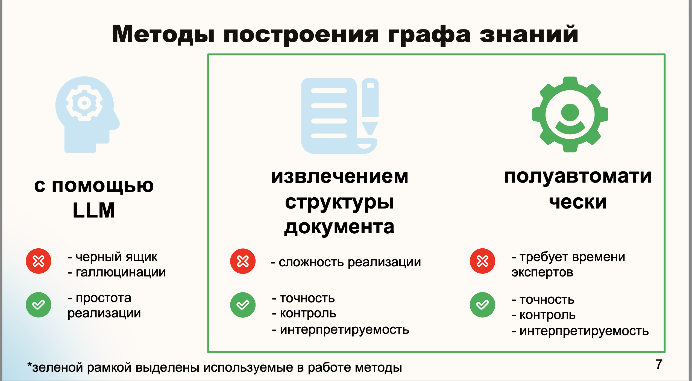

# Knowledge Graphs in the RAG. GraphGAR

Integration of the knowledge graph and LLM. The knowledge graph serves as an improved replacement for unstructured data chunk stores in QA systems.

The repository implements:
 - 🛠️ Creating a knowledge graph from the document (docx) structure or using LLM.
 - 💡 A proposal for the integration of the knowledge graph in RAG Pipeline.
 - 🚋 GraphRAG pipeline.
 - 🚀 A web service for working with the QA system based on the knowledge graph.


## install

1. clone repo:
` git clone  https://github.com/kodinkod/kg_llm.git `

2. install dependencies:
```
pip install poetry
poetry install 
poetry shell
```


## Usage
1. We use hydra framework for logging and use cofig.
2. For use all code we need have connection with neo4j db.



> ⚠️ warning: for use neo4j setup configs/neo4j/base.yaml (in config and .env files).
> for use openai LLM add all API keys. (in config and .env files).

### Create graph using structure 

Create html page with graph from docx document.
```
python examples/graph_creation/docs2graph_html.py 
```
[Example in output/html_graph_pages/Graph_for_group_test](output/html_graph_pages/Graph_for_group_test.html)

Load in neo4j (default: 'sandbox' database) graph from docx document.
```
python examples/graph_creation/graph_splitter_neo4j_base.py
```

### 🚋 GraphRag

```
python examples/rags/graph_rag.py # usage example  
python evaluting/test_advanced_graph_rag.py # calculate test set  
```

### 🥦 BaseRAG
```
python examples/rags/base.py # usage example  
python evaluting/test_base_rag.py # calculate test set  
```

### 🔫 Evalute RAG

We use Ragas and same custom metrics for evaluate RAG on our custom dataset 
from `assets/test_set_40.csv` abaut programm products in `assets`.

```
python evaluting/run_eval.py --config-name=<you-config>
```


## 🚀 Flask web UI 


   ```bash
    cd web_ui
    flask run
   ```
