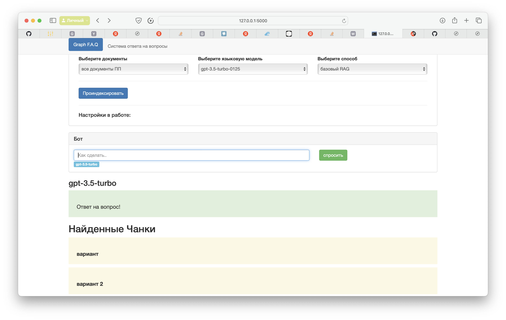

Python example app



It uses the [Flask](https://flask.palletsprojects.com/en/2.0.x/) web framework. Check out the tutorial or follow the instructions below to get set up.

## Setup

1. If you don’t have Python installed, [install it from here](https://www.python.org/downloads/).

2. Clone this repository.

3. Navigate into the project directory:

   ```bash
   $ cd web_ui
   ```

4. Install the requirements:

   ```bash
    pip install poetry
    poetry install 
    poetry shell
   ```

6. Make a copy of the example environment variables file:

   ```bash
   $ cp .env.example .env
   ```

7. Add your [API key](https://beta.openai.com/account/api-keys) to the newly created `.env` file.

8. Run the app:

   ```bash
   $ flask run
   ```


